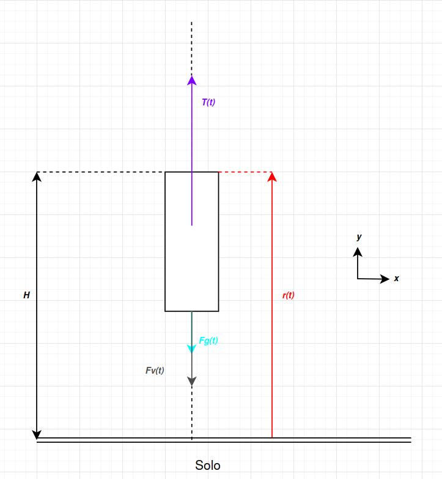

# Projeto de Física - Simulador de Foguete

Para executar a simulação, faça o download desse repositório e execute o seguinte comando para baixar as bibliotecas necessárias: `pip install -r libs.txt`.

Uma vez instaladas as bibliotecas, você deve rodar o comando `python3 main.py` para rodar a simulação, ou então, executar o arquivo `main.py` clicando duas vezes nele.
## Motivação para o projeto
O grupo, ao refletir sobre os possíveis temas para o projeto, achou que uma simulação de um foguete, levando em conta fatores como as camadas da atmosfera e quantidade de combustível disponível, seria uma escolha interessante. 

Isso porque é um objeto de estudo super conhecido, dado que até crianças conhecem um foguete, mas que poucas pessoas param para refletir sobre os conceitos físicos por trás do funcionamento dele e, até mesmo quando pensam, optam por não considerar alguns fatores como a resistência do ar. 

Logo, por ser uma tema cotidiano, mas que não é objeto de grande reflexão pela maioria das pessoas, optamos por montar um simulador de foguete que leva em consideração esses fatores. Assim, estaremos estimulando a reflexão sobre esse objeto.

## A física por trás da simulação
Como dito acima, estaremos considerando diversos conceitos físicos na nossa simulação,até mesmo alguns que, em estudos mais simples, são "ignorados". Além disso, estamos usando um sistema de coordenadas no $\mathbb{R}^{2}$. Segue uma lista de todos os conceitos físicos que estaremos considerando:
- Tempo
- Posição
- Velocidade (incluindo velocidade terminal)
- Aceleração
- Massa
- Densidade do Ar
- Gravidade
- Força Gravitacional
- Viscosidade
- Força Viscosa (nesse caso chamada de Arrasto também)
- Empuxo
- 2ª Lei de Newton

Abaixo pode-se ver o diagrama de forças que agem sobre o foguete na simulação.

  
   
  <em>Figura 1: Esquema</em>

Primeiramente, vamos ressaltar que os vetores estão todos em função do tempo.

O vetor $\vec{T}(t)$ que representa o empuxo. Ele é resultado de um cálculo envolvendo as características do motor e a quantidade de combustível disponível e, importante mencionar, o resultado final de $T(t)$ em nosso código já desconta a força gravitacional do motor com combustível. Falando no combustível, além da massa do foguete, foi considerada também a massa de combustível variando ao longo da simulação, conforme ele vai se esgotando.

O vetor $\vec{F_{v}}(t)$ representa a força viscosa. Ela foi calculada considerando a equação: $$\vec{F_{v}}(t) = - b \cdot \vec{v}(t),$$ na qual $b$ varia de acordo com a altura que estamos na atmosfera, já que a densidade do ar diminui conforme subimos na atmosfera e, consequentemente, a resistência (ou então a viscosidade) diminui. Por fim, $\vec{v}(t)$ é o vetor da velocidade.

O vetor $\vec{F_{g}}(t)$ representa a força gravitacional. Ela foi calculada usando a equação: $$\vec{F_{g}}(t) = - m \cdot g \cdot \vec{r}(t),$$ na qual $m$ considera somente a massa do foguete, já que a massa de combustível é descontada no empuxo. Além disso $g$ é a gravidade da terra, que é considerada constante, tal que $\displaystyle g = 9.80665 \frac{m}{s^{2}}$ nos nossos cálculos.

Para finalizar o diagrama, o vetor $\vec{r}(t)$ é o vetor posição do foguete. Ele pode ser decomposto em: $$\vec{r}(t) = x(t) \cdot \hat{i} + y(t) \cdot \hat{j}.$$

Agora, aprofundando na física do simulador. Nós primeiramente calculamos cada uma das forças e então calculamos a força resultante de todas elas. Em seguida, aplicamos a 2ª Lei de Newton: $$\vec{F} = m \cdot \vec{a},$$ para encontrarmos a aceleração do corpo. Então, nós integramos para achar o valor da velocidade e repetimos o processo para achar o valor da posição. Com esse valor em mão, atualizamos a posição do foguete.
## Sobre a simulação
Como dito anteriormente, o projeto trata-se de uma simulação de um foguete em condições semelhantes às encontradas por um foguete real. Nós consideramos 3 tipos de motores, que o usuário pode escolher livremente para simular. Além disso, consideramos 5 camadas para a atmosfera:
- Troposfera
- Estratosfera inferior
- Estratosfera superior
- Mesosfera inferior
- Termosfera

Cada uma tem a sua densidade do ar, o que causará um efeito diferente na aceleração e velocidade do foguete em cada nível.

Buscamos criar uma simulação user friendly e intuitiva, deixando claro para o usuário os comandos que ele pode realizar.

Agora, vamos nos aprofundar no foguete e o motor.
### Foguete
O foguete contém os seguintes atributos:
- Massa (não considera o combustível)
- Posição $\vec{p}$
- Velocidade $\vec{v}$
- Aceleração $\vec{a}$
- Eixo de guinada (ângulo) 
- Motor 

A classe foguete utiliza a classe Motor para gerar o empuxo.
O tipo de motor pode ser especificado

### Motor
O motor contém os seguintes atributos:
- Massa (não considera o combustível)
- Combustível (litros)
- Taxa de queima do combustível

O motor gera empuxo com base em seu peso e na velocidade gerada pela queima do combustível.

A classes de motor que podem ser utilizadas herdam de "RocketEngine" apenas as funções, alterando seus atributos (massa e taxa de queima).

## Organização do Grupo
Nós buscamos distribuir igualmente as tarefas pelos membros do grupo, principalmente no código, de modo que todos trabalhassem nele. Não foi realizada uma divisão de tarefas do código, atribuindo a cada um o que fazer. 

Na realidade buscamos algo mais próximo do que encontramos em projetos em grupo de software, que é como estamos nos organizando em outras disciplinas também, em que temos uma lista do que é necessário fazer e vamos trabalhando nela livremente, cada um escolhendo alguma tarefa, realizando-a e atualizando a lista.

Então, considerando o que cada um fez ao longo do projeto, podemos fazer as seguintes atribuições:
- Augusto: desenvolveu o código (principalmente do movimento do foguete) e montou o README
- Renan Trofino: desenvolveu o código (principalmente a classe foguete e motor)
- Renan Calusa: desenvolveu o código (principalmente deixando-o mais pythônico e documentando-o)
## Documentação do projeto
O projeto está divido principalmente em 7 arquivos. São eles:
- `main.py`: arquivo principal do projeto, nele são criadas as funções princpais como `game()` e `menu()`, que resultam no jogo e na tela de menu, respectivamente;
- `rocket.py`: arquivo que contém a classe do foguete e as funções relacionadas à ele, incluindo as de movimento. Ou seja, nesse arquivo está a maior parte da implementação da física do jogo;
- `engines.py`: arquivo que contém a classe dos motores e as funções relacionadas à ele, nele que está o cálculo do empuxo;
- `atmosphere`: arquivo que contém os cálculos necessários para achar a viscosidade de cada camada da atmosfera;
- `particles.py`: arquivo que contém o código para gerar as párticulas do foguete;
- `settings.py`: arquivo que contém a definição de algumas variáveis e constantes, por exemplo a gravidade $g$;
- `utils.py`: arquivo que contém funções secundárias

Além deles, tem a pasta `assets` que contém as imagens usada nesse repositório e no jogo. Os outros arquivos são arquivos gerados pelas IDEs como a pasta `.idea` e o `.gitignore`.
